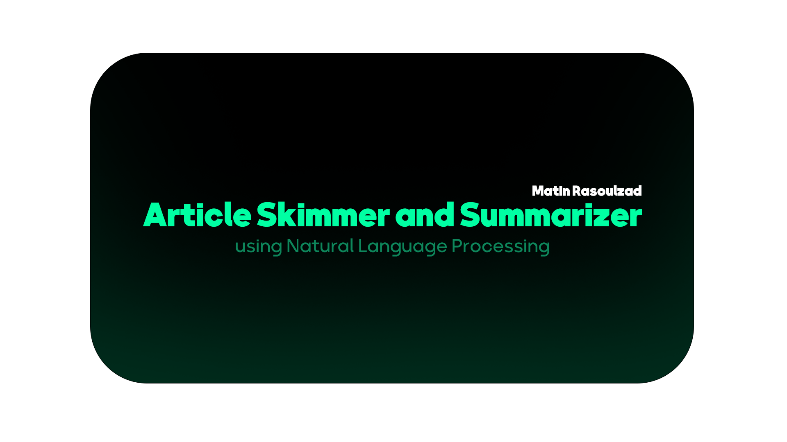
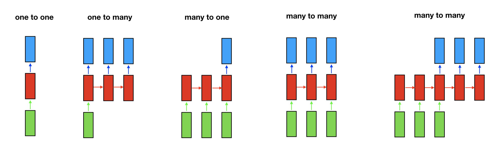
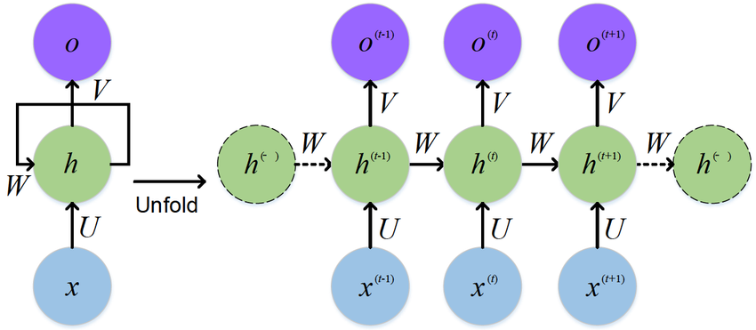
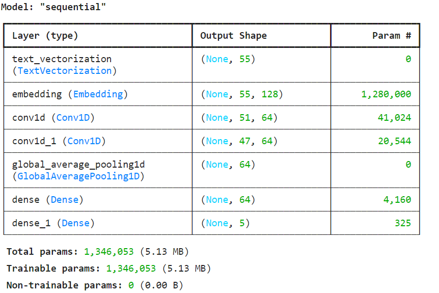
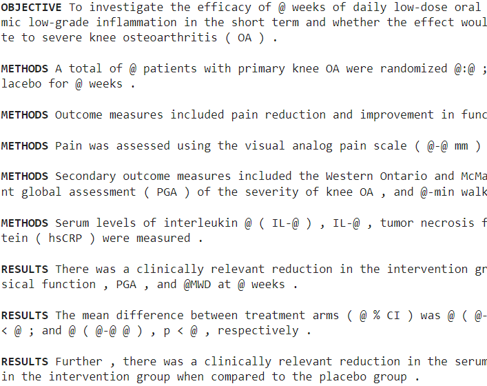
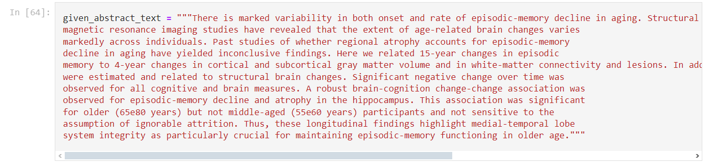
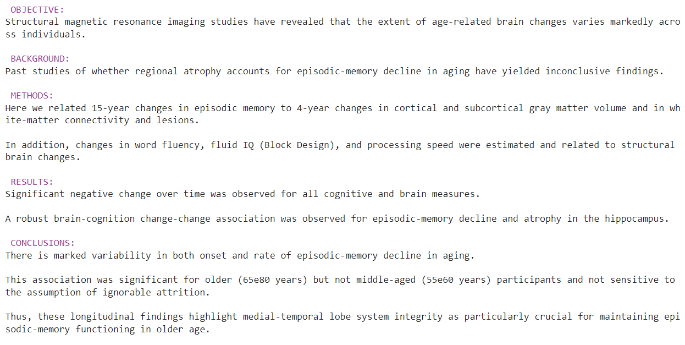

Article Summarization Using 1D-Convolutional neural networks
============

This project is an Article Skimmer and Summarizer, specifically trained on 20,000 RCT (Randomized Controlled Trial) articles on PUBMED(https://pubmed.ncbi.nlm.nih.gov). It has been developed using a `1D Convolutional Neural Network (CNN)`. In the future, we plan to incorporate additional advanced neural networks to enhance its functionality and performance.



## Architecture

Many-to-one sequence problems involve processing a sequential dataset to generate a single output. This is widely used in tasks such as sentiment analysis, text classification, and summarization. Below is a detailed professional description of the architecture tailored to handle such problems effectively.

### Architecture for Many-to-One Sequence Problems


#### 1. Input Layer
Processes sequential data (e.g., words or timestamps) into feature embeddings:
- **Embeddings**: Word2Vec, GloVe, or BERT.
- **Input Shape**: \( (T, F) \), where \( T \) is sequence length, \( F \) is feature size.

---

#### 2. Recurrent Neural Network (RNN) Layer
Captures sequential relationships using:
- **Options**: Standard RNNs, LSTMs, or GRUs.
- **Workflow**: Processes data step-by-step, updating hidden states.



---

#### 3. Contextual Encoding
Enhances sequence understanding with:
- **Bidirectional RNNs**: Processes forward and backward.
- **Attention Mechanisms**: Focuses on relevant sequence parts.

---

#### 4. Aggregation Layer
Unifies sequence outputs into a single representation:
- **Global Pooling**: Average or max over time steps.
- **Hidden State**: Uses the last or combined hidden states.

---

#### 5. Fully Connected Layers
Transforms aggregated data for prediction:
- **Activation**: ReLU (intermediate), softmax/sigmoid (output).
- **Regularization**: Dropout or L2 to prevent overfitting.

---

#### 6. Output Layer
Generates the final output:
- **Classification**: Softmax/sigmoid for labels.
- **Regression**: Linear activation for continuous outputs.

---

#### 7. Loss and Optimization
- **Loss**: Cross-entropy (classification) or MSE (regression).
- **Optimizers**: Adam, RMSprop, or SGD.
- **Batching**: Handles varying sequence lengths via padding.

---

This streamlined architecture is ideal for tasks like summarization, classification, and time-series predictions. The image below represents the final arch of the ANN:



## Dataset

We are using a commonly used dataset by **Franck Dernoncourt, Ji Young Lee**.<br>
<a href="https://arxiv.org/abs/1710.06071">PubMed 200k RCT: a Dataset for Sequential Sentence Classification in Medical Abstracts</a><br>
The dataset consists of approximately 200,000 abstracts of randomized controlled trials, totaling 2.3 million sentences. Each sentence of each abstract is labeled with their role in the abstract using one of the following classes: background, objective, method, result, or conclusion. 



## Code

The code is written in **python** language in **Jupiter notebook** & **Google Colab**.
I used numpy and matplotlib to visualize and preprocess data, On the top of that tensorflow helped me with building my CNN model.

You can access the notebook via `Notebook.ipynb` in my github (https://github.com/Matin-Rasoulzad/Article-Summarization-Using-NLP/blob/main/Notebook.ipynb)

## Input and Output


For example input is:



And output for that:


### Model accuracy

This CNN project has been trained in 3 different `Tiny VGG` models but with different learning rates


### Predictions

The predictions of the `Final Model`.

<br>

As you see it can confidentially classify `steak🥩` & `pizza🍕`.

<br>

In later versions we would try to add new food catagories from `Food 101 dataset`**(https://www.kaggle.com/datasets/dansbecker/food-101)**

## Installation

Instructions on how to install and run the project locally.

```bash
# Clone the repository
git clone https://github.com/Matin-Rasoulzad/Food-Image-classification-using-2DConv-TinyVGG.git

# Navigate to the project directory
cd Food-Image-classification-using-2DConv-TinyVGG

# Install dependencies
pip install tensorflow numpy matplotlib seaborn pandas
```

## Contribute

-   **GitHub:** [Matin-Rasoulzad](https://github.com/Matin-Rasoulzad)
-   **LinkedIn:** [Matin-Rasoulzad](https://www.linkedin.com/in/Matin-Rasoulzad)

Thank you for exploring the **Article Summarization Using NLP** project! We welcome contributions and feedback to enhance this tool.
